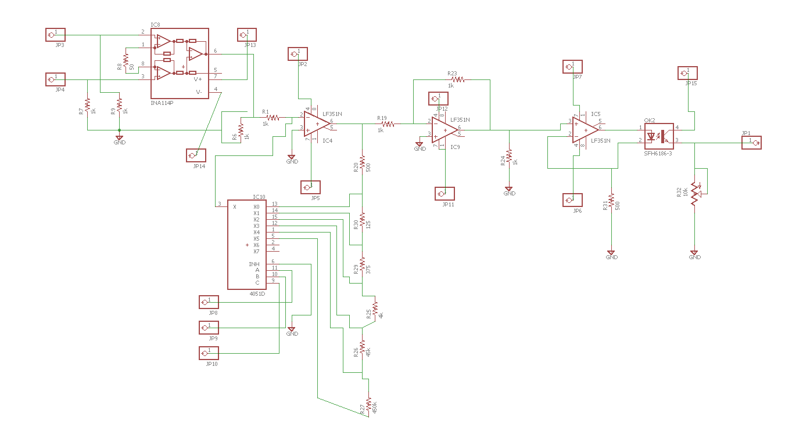
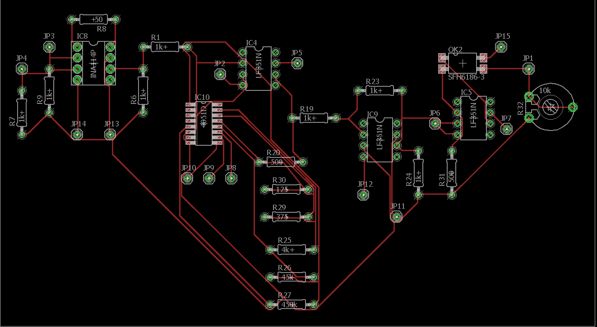
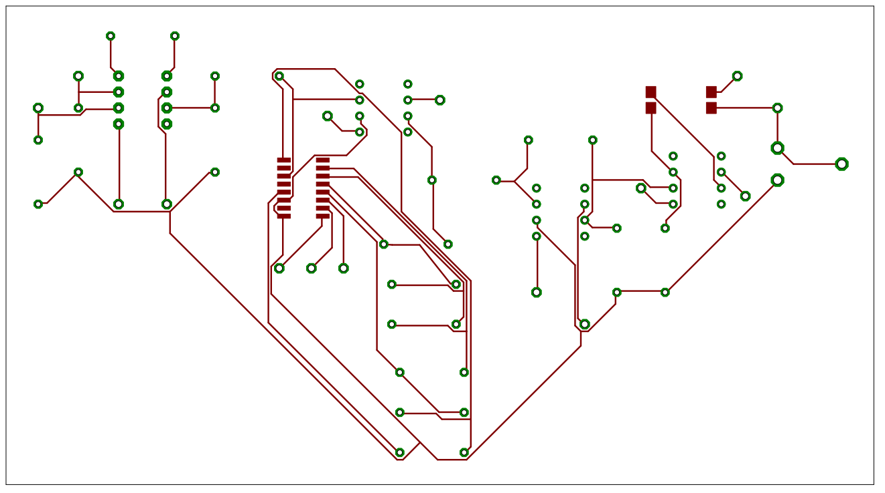

# Documentacion

## Circuito en proteus

# Circuito real

## Bits de seleccion de la escala 
|C|B|A|Escala|
|-|-|-|--------|
|0|0|0|10V|
|0|0|1|8V|
|0|1|0|5V|
|0|1|1|1V|
|1|0|0|100mV|
|1|0|1|10mV|

## Descripción de implementación del software
La conexión se logró mediante el script en Python conexión_sqlite3.py, este utiliza la biblioteca sqlite3 para trabajar con una base de datos SQLite llamada "DAQ" en el directorio "database". Primero, se intenta establecer una conexión con la base de datos, si esta no existe, SQLite la creará automáticamente. Luego, se crea un cursor para ejecutar comandos SQL.

El script realiza dos operaciones principales. En primer lugar, elimina la tabla "medicion" si existe en la base de datos. Luego, crea una nueva tabla "medicion" con cinco columnas. La estructura de la tabla incluye campos para autor, fecha, canal, tensión y vector.

El código está protegido con un bloque try...except, lo que significa que maneja posibles errores durante la ejecución. Si ocurre un error al ejecutar comandos SQL o al establecer la conexión a la base de datos, se captura la excepción y se muestra un mensaje de error en la consola. En resumen, el código se enfoca en establecer una conexión con la base de datos SQLite, gestionar la estructura de la tabla y manejar errores potenciales en el proceso.

La función send_data_db en Python se utiliza para insertar registros en una tabla de una base de datos SQLite llamada "medicion." La función toma dos argumentos: "autor" y "vector_list," y también establece valores predefinidos para "fecha," "canal," y "tensión." El argumento "vector_list" se procesa y convierte en una cadena de texto. Luego, se ejecuta una consulta SQL para insertar estos datos en la tabla. Si se produce un error durante el proceso, se maneja capturando excepciones y mostrando un mensaje de error.

# Propuesta de diseño PCB
Se realizó el siguiente esquemático utilizando EagleSoft:

Se propuso la siguiente disposición para el diseño de la PCB:

Se generó el archivo final con las capas importantes del PCB propuesto.

# Video demostrativo
[Video](https://youtu.be/nFeRRmKJOsY)
