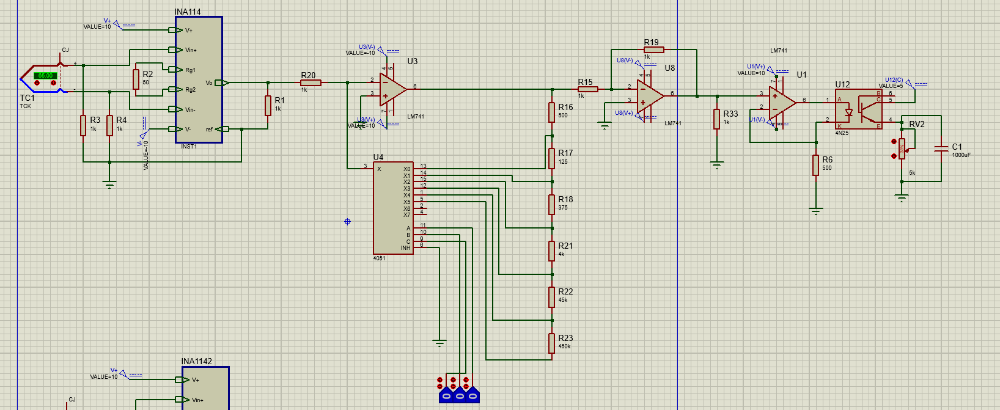
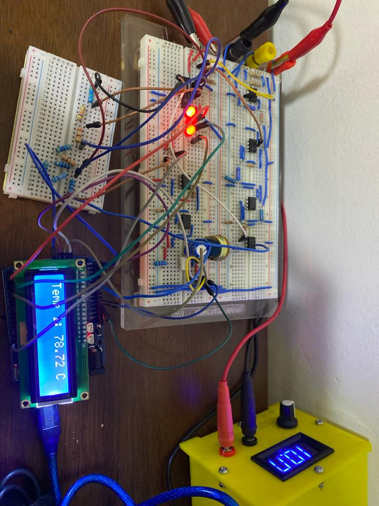

# Documentacion

## Circuito en proteus

# Circuito real

## Bits de seleccion de la escala 
|C|B|A|Escala|
|-|-|-|--------|
|0|0|0|10V|
|0|0|1|8V|
|0|1|0|5V|
|0|1|1|1V|
|1|0|0|100mV|
|1|0|1|10mV|

